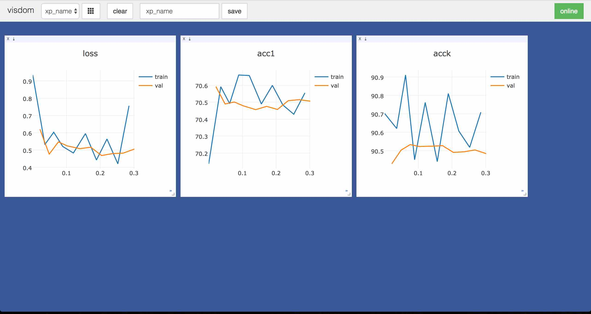

# A simple logger for experiments [](https://travis-ci.org/oval-group/logger)

Full credits to the authors of [tnt](https://github.com/pytorch/tnt) for the structure with metrics.

## Installation

To install the package, run:
* `pip install -r requirements.txt` (the only requirement are `GitPython` and `numpy`, `visdom` is optional but recommended for real-time visualization)
* `python setup.py install`.

## Example
The following example shows the functionalities of the package (full example code in `examples/example.py`):

```python
import logger
import numpy as np

#...
# code to generate fake data
#...


# some hyper-parameters of the experiment
lr = 0.01
n_epochs = 10

#----------------------------------------------------------
# Prepare logging
#----------------------------------------------------------

# create Experiment
xp = logger.Experiment("xp_name", use_visdom=True,
                       visdom_opts={'server': 'http://localhost', 'port': 8097},
                       time_indexing=False, xlabel='Epoch')
# log the hyperparameters of the experiment
xp.log_config({'lr': lr, 'n_epochs': n_epochs})
# create parent metric for training metrics (easier interface)
xp.ParentWrapper(tag='train', name='parent',
                 children=(xp.AvgMetric(name='loss'),
                           xp.AvgMetric(name='acc1'),
                           xp.AvgMetric(name='acck')))
# same for validation metrics (note all children inherit tag from parent)
xp.ParentWrapper(tag='val', name='parent',
                 children=(xp.AvgMetric(name='loss'),
                           xp.AvgMetric(name='acc1'),
                           xp.AvgMetric(name='acck')))
best1 = xp.BestMetric(tag="val-best", name="acc1")
bestk = xp.BestMetric(tag="val-best", name="acck")
xp.AvgMetric(tag="test", name="acc1")
xp.AvgMetric(tag="test", name="acck")

#----------------------------------------------------------
# Training
#----------------------------------------------------------

for epoch in range(n_epochs):
    # train model
    for (x, y) in training_data():
        loss, acc1, acck = oracle(x, y)
        # accumulate metrics (average over mini-batches)
        xp.Parent_Train.update(loss=loss, acc1=acc1,
                               acck=acck, n=len(x))
    # log metrics (i.e. store in xp and send to visdom) and reset
    xp.Parent_Train.log_and_reset()

    for (x, y) in validation_data():
        loss, acc1, acck = oracle(x, y)
        xp.Parent_Val.update(loss=loss, acc1=acc1,
                             acck=acck, n=len(x))
    xp.Parent_Val.log_and_reset()
    best1.update(xp.acc1_val).log()  # will update only if better than previous values
    bestk.update(xp.acck_val).log()  # will update only if better than previous values

for (x, y) in test_data():
    _, acc1, acck = oracle(x, y)
    # update metrics individually
    xp.Acc1_Test.update(acc1, n=len(x))
    xp.Acck_Test.update(acck, n=len(x))
xp.log_with_tag('test')

print("=" * 50)
print("Best Performance On Validation Data:")
print("-" * 50)
print("Prec@1: \t {0:.2f}%".format(best1.value))
print("Prec@k: \t {0:.2f}%".format(bestk.value))
print("=" * 50)
print("Performance On Test Data:")
print("-" * 50)
print("Prec@1: \t {0:.2f}%".format(xp.acc1_test))
print("Prec@k: \t {0:.2f}%".format(xp.acck_test))

#----------------------------------------------------------
# Save & load experiment
#----------------------------------------------------------

# save file
xp.to_json("my_json_log.json")  # or xp.to_pickle("my_pickle_log.pkl")

xp2 = logger.Experiment("")  # new Experiment instance
xp2.from_json("my_json_log.json")  # or xp.from_pickle("my_pickle_log.pkl")
xp2.to_visdom(visdom_opts={'server': 'http://localhost', 'port': 8097})  # plot again data on visdom
```

This generates (twice) the following plots on `visdom`:



## Documentation

There are two types of objects in this package: `Experiment` and `Metric`. An `Experiment` instance serves as an interface, and all `Metric` objects are attached to it (details below).

### Logging Hyper-Parameters

Hyper-parameters can easily be stored in the configuration of an experiment, by passing a dictionary to `log_config`:
```python
xp = logger.Experiment("my_xp_name")  # creating an experiment
n_epochs = 100
lr = 0.01
hp_dict = dict(n_epochs=n_epochs, lr=lr)  # create dictionary of hyper-parameters
xp.log_config(hp_dict)  # store hyper-parameters in experiment
```

The main use case of this package is to use metrics to monitor various values during an experiment. We detail this below.

### Types of Metrics
* `SimpleMetric`: yields the value of the last update
* `TimeMetric`: yields the time difference between the last update and the last reset
* `AvgMetric`: yields the (possibly weighted) average of all updates since last reset
* `SumMetric`: yields the (possibly weighted) sum of all updates since last reset
* `BestMetric`: yields the best value given in update since last reset (best: largest in "max" mode, smallest in "min" mode)
* `DynamicMetric`: requires a function to obtain its value, yields value obtained by a call to the function at last update
* `ParentWrapper`: wraps around children metrics, yields a dictionary with values of its children

### Creating a Metric

Metrics are instantiated through the `Experiment` object:
```python
xp = logger.Experiment("my_xp_name")  # creating an experiment
xp.SimpleMetric(name="score")  # creating a simple metric
```

A metric is identified by a combination of name (required when creating the metric) and tag (optional, set to "default" by default). For machine learning experiments, we suggest to use tags like "train", "val" and "test" to identify metrics on training, validation and testing data sets. We recommend to use strings in lower case without special characters for the names and tags.

### Accessing a Metric Object

A metric can be accessed by any of the following:
* The object returned at instantiation:
```python
xp = logger.Experiment("my_xp_name")
my_metric = xp.SimpleMetric(name="score", tag="cool")
```
* A call to `get_metric` on the `Experiment` object:
```python
xp = logger.Experiment("my_xp_name")
xp.SimpleMetric(name="score", tag="cool")
my_metric = xp.get_metric(name="score", tag="cool")
```

* An attribute request to the `Experiment` object based with the formatting `{}_{}.format(name, tag).title()`:
```python
xp = logger.Experiment("my_xp_name")
xp.SimpleMetric(name="score", tag="cool")
my_metric = xp.Score_Cool
```

NB: if the metric has the "default" tag, it can be accessed without the tag:
```python
xp = logger.Experiment("my_xp_name")
xp.SimpleMetric(name="score")
my_metric = xp.Score
```

### Updating & Getting the Value of a Metric

The value of a metric is updated through the `update` method, and is obtained through the property `value` (equivalent to a call to the `get` method in previous versions, still accessible):
```python
xp = logger.Experiment("my_xp_name")
xp.SimpleMetric(name="score")
xp.Score.update(10) # set the value of the metric to 10.
xp.Score.value  # returns 10.
```

The value given in the `update` method of a metric must be one of the following:
* pytorch autograd Variable with one element
* pytorch tensor with one element
* numpy array with one element
* any type supported by the python `float()` function

It is then converted to a python `float` number.

For a `ParentWrapper`, the arguments of `update` must be named with child names, and the `value` property returns a dictionary:
```python
xp = logger.Experiment("my_xp_name")
xp.ParentWrapper(name="parent",
                 children=(xp.SimpleMetric("child1"),
                           xp.SimpleMetric("child2"),
                           xp.SimpleMetric("child3")))
xp.Parent.update(child1=3, child2=5) # set the value of the metric xp.Child1 to 3. and xp.Child2 to 5.
xp.Parent.update(child3=9) # set the value of the metric xp.Child3 to 9.
xp.Parent.value  # returns {'child1': 3., 'child2': 5., 'child3': 9.}
```

Note that `update` returns the metric, which allows for the following syntax:
```python
xp = logger.Experiment("my_xp_name")
xp.SumMetric(name="score")
xp.Score.update(10).update(1) # add 10. and then 1.
xp.Score.value  # returns 11.
```

### Logging a Metric

When a metric is storing a value worth keeping or displaying, it should be logged through:
```python
xp = logger.Experiment("my_xp_name")
xp.SimpleMetric(name="score")
xp.Score.update(10) # set the value of the metric to 10
xp.Score.log() # log value of metric (preferred syntax)
xp.log_metric(xp.Score) # equivalent syntax (NB: logging a second time creates a second logged value)
```

This logs the value of the metric in the attribute `logged` of `xp`. It also updates the index of the metric (see next section). If `xp` is connected to a plotting backend (e.g. `visdom`), this also sends the value of the metric to be displayed.

The last logged value of a metric can be accessed with the attribute formatted as `{}_{}.format(name, tag).lower()`:
```python
xp = logger.Experiment("my_xp_name")
xp.SimpleMetric(name="score")
xp.Score.update(10) # set the value of the metric to 10.
xp.Score.log()
xp.score  # returns 10.
xp.Score.update(11) # set the value of the metric to 11.
xp.score  # still returns 10. (value of 11 not logged)
```

### Indexing a Metric

Every metric is indexed by either a `ValueIndex` or a `TimeIndex`. This allows to have values for an x-axis when logging the information. The index is modified when the metric is logged (more on that below). By default, `TimeIndex` updates its value at the time of the log, and `ValueIndex` increments a counter by one.

The default behavior is that all metrics are indexed by a `TimeIndex` (except for `TimeMetric`, which is always indexed by a `ValueIndex`). This default behavior can be changed to value indexing, by setting `time_indexing=False` when creating the `Experiment`.

A custom indexing value can be used when logging the metric:
```python
xp = logger.Experiment("my_xp_name", time_indexing=False)
xp.SimpleMetric(name="score")
xp.Score.update(0.1)
xp.Score.log(10) # log with index 10 (instead of default start of 0)
xp.Score.update(0.3)
xp.Score.log() # log with index 10+1=1
xp.Score.update(0.4)
xp.Score.log(idx=100) # log with custom index 100
xp.Score.update(0.5)
xp.log_metric(xp.Score, idx=50) # log with custom index 50 (different syntax)
# The logged values are [[10, 0.1], [11, 0.3], [50, 0.5], [100, 0.4]]
```


### Resetting a Metric

For some metrics, the value depends on the last reset: for instance `AvgMetric` average all values since the last reset, and `TimeMetric` measures the elapsed time since the last reset. Metrics can be reinitialized through the `reset` method:
```python
xp = logger.Experiment("my_xp_name")
xp.SumMetric(name="score")
xp.Score.update(3)
xp.Score.value  # returns 3.
xp.Score.update(2)
xp.Score.value  # returns 5.
xp.Score.reset()
xp.Score.value  # returns 0.
```

Note that instead of calling `log()` followed by `reset()`, a metric can be logged and reset through a single call to `log_and_reset()`.

### Saving an Experiment

Experiments can be easily saved to `json` or `pickle` formats (and can then be loaded). Saving an `Experiment` stores the hyper-parameters logged, and all values of metrics logged throughout the experiment. All metrics and their unlogged values are discarded. The syntax is as follows:

```python
xp = logger.Experiment("my_xp_name", time_indexing=False)
xp.log_config({'n_epochs': 100, 'lr': 0.01})
xp.SimpleMetric(name="score", tag="cool")
xp.SimpleMetric(name="score", tag="cooler")
xp.Score_Cool.update(2.5)
xp.Score_Cool.log()
xp.Score_Cool.update(3.6)
xp.Score_Cool.log()
xp.Score_Cooler.update(5.7)
xp.Score_Cooler.log()
xp.Score_Cooler.update(6.8)
xp.Score_Cooler.log()
xp.to_json("my_xp.json")  # or xp.to_pickle("my_xp.pkl")

del xp

xp = logger.Experiment("dummy_name")
xp.from_json("my_xp.json")  # or xp.from_pickle("my_xp.pkl")
xp.name  # "my_xp_name"
xp.config  # {'n_epochs': 100, 'lr': 0.01}
xp.logged  # {'cool': {'score': {[0, 2.5], [1, 3.6]}}, 'cooler': {'score': {[0, 5.7], [1, 6.8]}}}
xp.to_visdom()  # send the logged data to visdom
```

